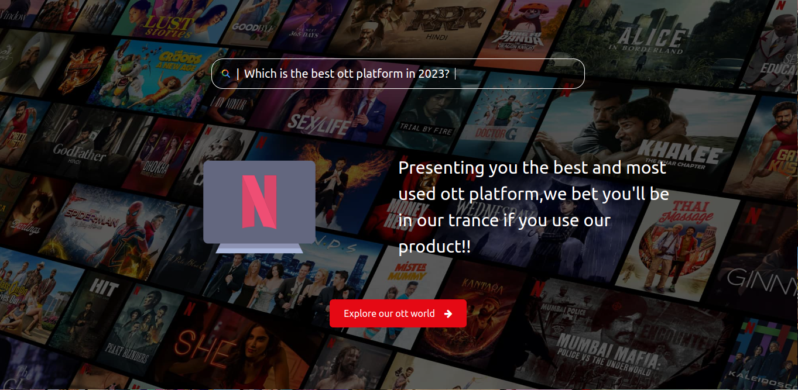

<h1>ShowTime-An OTT platform</h1>
<h2>Tech Stack Used:</h2>
<h3>Frontend:</h3>
<ul>
	<li>React</li>
	<li>tailwindcss</li>
	<li>antd</li>
</ul>
<h3>Backend:</h3>
<ul>
	<li>Nodejs</li>
	<li>Expressjs</li>
	<li>Sequelize for ORM implementation</li>
	<li>Socket.io for chat functionality</li>
	<li>Mysql for Database</li>
</ul>
<i>Main aim of the project is to develop an OTT platform,where users can watch their favourite shows,movies etc., in a flexible way through laptop,mobile phone.We are not only providing movies but also webisodes
One of the best feature added to out platform is chatting feature,where user will get great experience with his friends by sharing their views,trolls on the movie,show etc., they are watching.This will help them communicate each other even they are watching different shows,movies etc., and even they are remote places.</i>
<h2>Home Page</h2>

<h2>Login Page</h2>

<h2>Main screen</h2>

<h2>Video Cards</h2>

<h2>VideoDisplay Page</h2>

<h2>Chatting Feature</h2>

<h2>Chat Functionality</h2>

